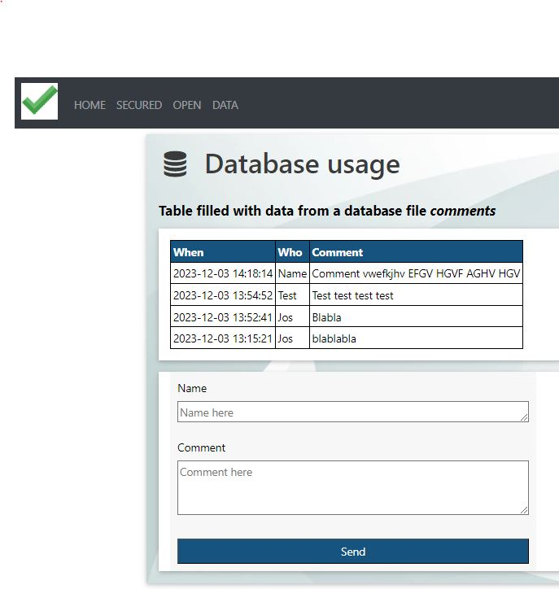

# Flask_blueprint
Kickstart a new Flask project

## steps to create the project
**1. Clone the github project to your local environment**
>       best use github together with Visual Studio
**2. Create a virtual environment**
>       py -3 -m venv venv
**3. Install all modules needed**
>       python -m pip install flask pytz logging flask_session
**4. Activate the virtual environment**
>       venv\Scripts\activate
**5. Start the Flask app in the virtual environment**
>       flask run 
>       (can be reached at http://127.0.0.1:5000/)

**6. App runs with screens below**
>      

**7. Visitor/Password for secured page**
>       initially the static credentials are set to: TEST / T3st!

**8. Look & feel**
>       The look & feel is configured using CSS, The following stylesheets are used:
>       - www.w3schools.com/w3css/4/w3.css
>       - cdnjs.cloudflare.com/ajax/libs/font-awesome/4.7.0/css/font-awesome.min.css
>       - cdn.jsdelivr.net/npm/bootstrap@4.5.3/dist/css/bootstrap.min.css

**9. Added the use of data (comments) managed in a SQLITE database**
>       CREATE TABLE "Comments" (
>       "recnr"	INTEGER NOT NULL UNIQUE,
>   	"name"	TEXT,
>   	"dttm"	TEXT,
>       "comment"	TEXT,
>       PRIMARY KEY("recnr" AUTOINCREMENT)
>       );

